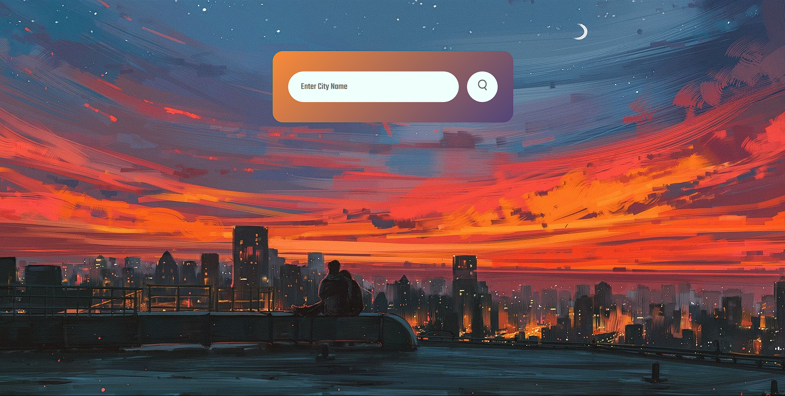

<h1 align="center">
    
</h1>
<h1 align="center">
  <a href="https://weather573.netlify.app/"> Weather App</a>
</h1>

<p align="center">

  

  <a href="https://github.com/Mominuddin07/Weather-App">
    
  </a>

  

  <a href="https://github.com/Mominuddin07/">
    
  </a>
</p>


<h4 align="center"> 
	 Status: Finished
</h4>

<p align="center">
 <a href="#about">About</a> •
 <a href="#features">Features</a> •
 <a href="#how-it-works">How it works</a> • 
 <a href="#tech-stack">Tech Stack</a> •  
 <a href="#author">Author</a> 
</p>

---

## About

**Weather-App**The Weather App displays real-time weather data using the **OpenWeatherMap API**. It shows temperature, humidity, and conditions for any city. Built with HTML, CSS, and JavaScript, it offers a clean and responsive interface.

---

## Features

- [x] **Real-time weather data** for any city.
- [x] Displays **temperature, humidity,** and **weather** conditions.
- [x] Fully responsive for both **desktop** and **mobile** devices

---

## Demo
Check out the live demo here: [Weather App](https://weather573.netlify.app/)
<h1 align="center">

## How it works

1. **Frontend** (this repository): Built using **Java Script**, styled with **CSS**, displays real-time weather data using the **OpenWeatherMap API**.

### Pre-requisites

Before you begin, ensure you have the following tools installed:
- [Git](https://git-scm.com)
- [VSCode](https://code.visualstudio.com/) (or any code editor)

### Running the web application (Frontend)

1. Clone the repository:
```bash
git clone https://github.com/Mominuddin07/Weather-App

```

## Tech Stack

The following tools were used in the construction of the project:

#### **Platform**
- **HTML** For building the user interface
- **CSS** For styling and responsiveness
- **JavaScript** for the interactive elements


#### **Tools Used**
- **[Visual Studio Code](https://code.visualstudio.com/)** → The code editor used to write and edit the project files.
- **[Google Fonts](https://fonts.google.com/)** → Used for fonts, enhancing the website's typography.
- **[Font Awesome](https://fontawesome.com/)** → Used for icons throughout the website.

---

## Author

<a href="https://www.linkedin.com/in/mohammed-mominuddin-350180259/">
 
 <br />
 <p><b>Mohammed Mominuddin</b></p></a>
 
[](https://www.linkedin.com/in/mohammed-mominuddin-350180259/)

---

## License

This project is licensed under the [MIT License](./LICENSE).

Made with love by Mohammed Mominuddin 👋🏽 [Get in Touch!](https://www.linkedin.com/in/mohammed-mominuddin-350180259/)

---

## Learn More

This project leverages edge technologies:
- [HTML](https://developer.mozilla.org/en-US/docs/Web/HTML) → For structuring the web page.  
- [CSS](https://developer.mozilla.org/en-US/docs/Web/CSS) → For styling and making the design responsive.  
- [OpenWeatherMap API](https://openweathermap.org/) → For fetching real-time weather data.  


To explore these technologies further, check out their official documentation.
